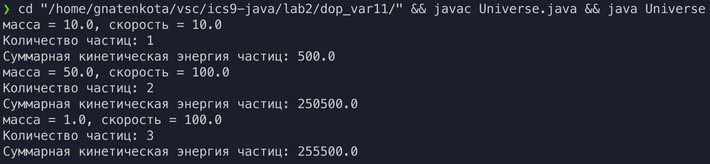

# Цели

Реализовать модель вселенной.

# Задачи

Вычислить среднюю кинетическую энергию частиц вселенной.

# Решение

## Исходный код

`Universe.java`

```java
public class Universe
{
    public static void main(String[] args) {
        Particle A = new Particle(10, 10);
        A.data();
        A.n();
        A.e();

        Particle B = new Particle(50, 100);
        B.data();
        B.n();
        B.e();

        Particle C = new Particle(1, 100);
        C.data();
        C.n();
        C.e();
    }
}

```

`Particle.java`

```java
public class Particle {
    private static int n = 0;
    private static double e = 0;
    private double m, v;

    public Particle(double inM, double inV){
        this.m = inM;
        this.v = inV;
        Particle.n += 1;
        Particle.e += m * v * v / 2;
    }

    public void n(){
        System.out.println("Количество частиц: " + Particle.n);
    }

    public void e(){
        System.out.println("Суммарная кинетическая энергия частиц: " + Particle.e);
    }

    public void data(){
        System.out.println("масса = " + this.m + ", скорость = " + this.v);
    }
}

```
## Пример вывода



