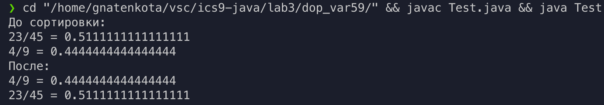

# Цели

Приобретение навыков реализации интерфейсов для обеспечения возможности
полиморфной обработки объектов класса.

# Задачи

Класс дробей, числитель и знаменатель которых взаимно просты, с естественным порядком на множестве рациональных чисел.

# Решение

## Исходный код

**`Fraction.java`**

```java
public class Fraction implements Comparable<Fraction>{
    private int a, b;
    public Fraction(int inA, int inB){
        this.a = inA;
        this.b = inB;
    }

    public double rational(){ 
        return (double)a / (double)b;
    }

    public int compareTo(Fraction obj) {
        if (rational() < obj.rational()) return -1;
        if (rational() == obj.rational()) return 0;
        return 1;
    }

    public String toString(){
        return a + "/" + b + " = " + rational();
    }
}

```

**`Test.java`**

```java
import java.util.Arrays;

public class Test {
    public static void main(String[] args) {
        Fraction[] Fractions = new Fraction[]{
            new Fraction(23, 45),
            new Fraction(4, 9)
        };
        System.out.println("До сортировки:");
        for (Fraction f : Fractions) System.out.println(f);
        Arrays.sort(Fractions);
        System.out.println("После: ");
        for (Fraction f : Fractions) System.out.println(f);
    }
}

```

## Пример вывода

