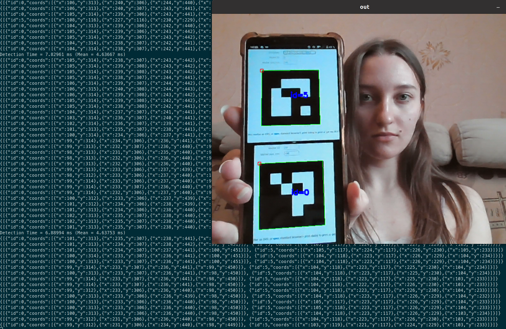

# Цели

На примере задачи распознавания ArUco маркеров разобраться с установкой библиотеки OpenCV и изучить примеры ее использования на языке С++. 

# Задачи

- Реализовать пример detect_markers.cpp.
- Реализовать вывод координат углов ArUco меток Задачи в консоль. 
- Реализовать вывод координат углов ArUco меток Задачи в формате JSON.

# Решение

## Исходный код

**`Detect_markers.cpp`**

```cpp
#include <opencv2/highgui.hpp>
#include <opencv2/aruco.hpp>
#include <iostream>
#include "../aruco_samples_utility.hpp"
#include <opencv2/opencv.hpp>

using namespace std;
using namespace cv;

namespace {
const char* about = "Basic marker detection";

//! [aruco_detect_markers_keys]
const char* keys  =
        "{d        |       | dictionary: DICT_4X4_50=0, DICT_4X4_100=1, DICT_4X4_250=2,"
        "DICT_4X4_1000=3, DICT_5X5_50=4, DICT_5X5_100=5, DICT_5X5_250=6, DICT_5X5_1000=7, "
        "DICT_6X6_50=8, DICT_6X6_100=9, DICT_6X6_250=10, DICT_6X6_1000=11, DICT_7X7_50=12,"
        "DICT_7X7_100=13, DICT_7X7_250=14, DICT_7X7_1000=15, DICT_ARUCO_ORIGINAL = 16,"
        "DICT_APRILTAG_16h5=17, DICT_APRILTAG_25h9=18, DICT_APRILTAG_36h10=19, DICT_APRILTAG_36h11=20}"
        "{cd       |       | Input file with custom dictionary }"
        "{v        |       | Input from video or image file, if ommited, input comes from camera }"
        "{ci       | 0     | Camera id if input doesnt come from video (-v) }"
        "{c        |       | Camera intrinsic parameters. Needed for camera pose }"
        "{l        | 0.1   | Marker side length (in meters). Needed for correct scale in camera pose }"
        "{dp       |       | File of marker detector parameters }"
        "{r        |       | show rejected candidates too }"
        "{refine   |       | Corner refinement: CORNER_REFINE_NONE=0, CORNER_REFINE_SUBPIX=1,"
        "CORNER_REFINE_CONTOUR=2, CORNER_REFINE_APRILTAG=3}";
}
//! [aruco_detect_markers_keys]

int main(int argc, char *argv[]) {
    CommandLineParser parser(argc, argv, keys);
    parser.about(about);

    if(argc < 2) {
        parser.printMessage();
        return 0;
    }

    bool showRejected = parser.has("r");
    bool estimatePose = parser.has("c");
    float markerLength = parser.get<float>("l");

    Ptr<aruco::DetectorParameters> detectorParams = aruco::DetectorParameters::create();
    if(parser.has("dp")) {
        FileStorage fs(parser.get<string>("dp"), FileStorage::READ);
        bool readOk = aruco::DetectorParameters::readDetectorParameters(fs.root(), detectorParams);
        if(!readOk) {
            cerr << "Invalid detector parameters file" << endl;
            return 0;
        }
    }

    if (parser.has("refine")) {
        //override cornerRefinementMethod read from config file
        detectorParams->cornerRefinementMethod = parser.get<int>("refine");
    }
    std::cout << "Corner refinement method (0: None, 1: Subpixel, 2:contour, 3: AprilTag 2): " << detectorParams->cornerRefinementMethod << std::endl;

    int camId = parser.get<int>("ci");

    String video;
    if(parser.has("v")) {
        video = parser.get<String>("v");
    }

    if(!parser.check()) {
        parser.printErrors();
        return 0;
    }

    Ptr<aruco::Dictionary> dictionary;
    if (parser.has("d")) {
        int dictionaryId = parser.get<int>("d");
        dictionary = aruco::getPredefinedDictionary(aruco::PREDEFINED_DICTIONARY_NAME(dictionaryId));
    }
    else if (parser.has("cd")) {
        FileStorage fs(parser.get<std::string>("cd"), FileStorage::READ);
        bool readOk = aruco::Dictionary::readDictionary(fs.root(), dictionary);
        if(!readOk) {
            std::cerr << "Invalid dictionary file" << std::endl;
            return 0;
        }
    }
    else {
        std::cerr << "Dictionary not specified" << std::endl;
        return 0;
    }

    Mat camMatrix, distCoeffs;
    if(estimatePose) {
        bool readOk = readCameraParameters(parser.get<string>("c"), camMatrix, distCoeffs);
        if(!readOk) {
            cerr << "Invalid camera file" << endl;
            return 0;
        }
    }

    VideoCapture inputVideo;
    int waitTime;
    if(!video.empty()) {
        inputVideo.open(video);
        waitTime = 0;
    } else {
        inputVideo.open(camId);
        waitTime = 10;
    }

    double totalTime = 0;
    int totalIterations = 0;

    while(inputVideo.grab()) {
        Mat image, imageCopy;
        inputVideo.retrieve(image);

        double tick = (double)getTickCount();

        vector< int > ids;
        vector< vector< Point2f > > corners, rejected;
        vector< Vec3d > rvecs, tvecs;

        // detect markers and estimate pose
        aruco::detectMarkers(image, dictionary, corners, ids, detectorParams, rejected);
        if(estimatePose && ids.size() > 0)
            aruco::estimatePoseSingleMarkers(corners, markerLength, camMatrix, distCoeffs, rvecs,
                                             tvecs);

        double currentTime = ((double)getTickCount() - tick) / getTickFrequency();
        totalTime += currentTime;
        totalIterations++;
        if(totalIterations % 30 == 0) {
            cout << "Detection Time = " << currentTime * 1000 << " ms "
                 << "(Mean = " << 1000 * totalTime / double(totalIterations) << " ms)" << endl;
        }
        if (corners.size() > 0) {
		cout << "{[";
		auto ii = 0;
		for (auto i : corners){
			cout << "{\"id\":" << ids[ii] << ",\"coords\":[";
			for (size_t j = 0; j < i.size() - 1; j++) {
				cout << "{\"x\":"<< i[j].x << ",\"y\":"<< i[j].y <<"},";
			}
			cout << "{\"x\":"<< i[i.size() - 1].x << ",\"y\":"<< i[i.size() - 1].y <<  "}]";
			if (ii != ids.size() - 1) {cout << "}, ";
			}else {cout << "}";};
			ii++;
		}
		cout<<"]}\n";
	};
        // draw results
        image.copyTo(imageCopy);
        if(ids.size() > 0) {
            aruco::drawDetectedMarkers(imageCopy, corners, ids);

            if(estimatePose) {
                for(unsigned int i = 0; i < ids.size(); i++)
                    cv::drawFrameAxes(imageCopy, camMatrix, distCoeffs, rvecs[i], tvecs[i], markerLength * 1.5f, 2);
            }
        }

        if(showRejected && rejected.size() > 0)
            aruco::drawDetectedMarkers(imageCopy, rejected, noArray(), Scalar(100, 0, 255));

	Mat resized;
	resize(imageCopy, resized, Size(1600, 1200));

        imshow("out", resized);
        char key = (char)waitKey(waitTime);
        if(key == 27) break;
    }

    return 0;
}
```

## Вывод


