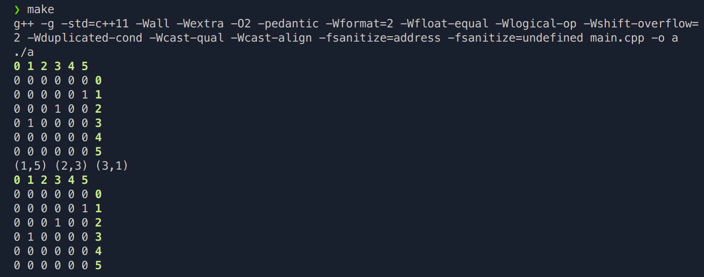

# Цели

Данная работа предназначена для приобретения навыков разработки контейнерных классов с итераторам.

# Задачи

Бинарное отношение на множестве целых чисел от 0 до n с константным однонапавленным итератором по всем парам чисел, принадлежащим отношению (отношение должно быть представлено булевской матрицей).

# Решение

## Исходный код

**`BinaryRelation.hpp`**

```cpp

#ifndef BINARY_RELATION
#define BINARY_RELATION 1

#include <cstdlib>
#include <cstddef>
#include <iostream>
#include <iterator>
#include <utility>
#include <vector>
#include <cstring>
#include <string>

class BinaryRelation{
public:
    struct ConstantIterator{
        using iterator_category = std::forward_iterator_tag;
        using difference_type = std::ptrdiff_t;
        using value_type = std::pair<size_t, size_t>;
        using pointer = std::pair<size_t, size_t>*;
        using reference = std::pair<size_t, size_t>&; 

        ConstantIterator(bool* ptr, size_t n, bool x) : matrix(ptr), i(n + 1), j(n + 1), n(n){
            if (x){
                size_t ii = 0;
                size_t jj = 0;
                bool flag = true;
                while((ii <= n) && flag){
                    while((jj <= n) && flag){
                        if (matrix[jj + ii *(1+n)] == true){
                            flag = false;
                            i = ii;
                            j = jj;
                        }
                        jj++;
                    }
                    ii++;
                    jj = 0;
                }
            }
        }

        const reference operator*() {
            a = new std::pair<size_t, size_t>(i , j);
            return *a;
        }
        //const pointer operator->() const { return matrix; }
        ConstantIterator& operator++() {
            if (a != NULL){
                delete a;
            }
            j++;
            while(i <= n){
                while(j <= n){
                    if (matrix[j + i *(1+n)] == true){
                        return *this;
                    }
                    j++;
                }
                i++;
                j = 0;
            }
            if (i == n + 1){
                matrix = matrix + (n + 1) * (n + 1);
            }
            return *(this);
        } 
        ConstantIterator& operator--() { matrix--; return *this; } 
        ConstantIterator operator++(int) { ConstantIterator tmp = *this; ++(*this); return tmp; }
        ConstantIterator operator--(int) { ConstantIterator tmp = *this; --(*this); return tmp; }
        friend bool operator== (const ConstantIterator& a, const ConstantIterator& b) { return a.matrix == b.matrix; };
        friend bool operator!= (const ConstantIterator& a, const ConstantIterator& b) { return a.matrix != b.matrix; };

private: 
    bool* matrix;
    size_t i, j, n;
    pointer a;
    };


private: 
    //std::vector<bool> matrix;
    bool* matrix;

    size_t n;

public:
    BinaryRelation(bool (*f)(size_t, size_t), size_t n);
    virtual ~BinaryRelation();
    void printMatrix();
    size_t getN();

    ConstantIterator begin() const { return ConstantIterator(&matrix[0], n, true); }
    ConstantIterator end() const { return ConstantIterator(&matrix[(n + 1)*(n + 1)], n, false); }
};

BinaryRelation::BinaryRelation(bool (*f)(size_t, size_t), size_t n):n(n){
    matrix = new bool[(n + 1)*(n + 1)];
    for (size_t i = 0; i <= n; i++)
    {
            for (size_t j = 0; j <= n; j++){
                matrix[j + i * (n + 1)] = f(i, j);
            }
    }
}

BinaryRelation::~BinaryRelation(){
    delete [] matrix;
}

size_t BinaryRelation::getN(){
    return n + 1;
}

void BinaryRelation::printMatrix(){
    for (size_t i = 0; i <= n; i++){
        std::cout << "\x1b[32;1m"<< i << "\x1b[0m" << ' ';
    }
    std::cout << "\n";
    for (size_t i = 0; i <= n; i++){
        for (size_t j = 0; j <= n; j++){
            std::cout << matrix[j + i * (n + 1)] << std::string((std::to_string(j)).length(), ' ');
        }
        std::cout << "\x1b[32;1m"<< i << "\x1b[0m" << "\n";
    }
}

#endif

```
**`main.cpp`**

```cpp
#include <cstdlib>
#include <iostream>
#include "BinaryRelation.hpp"

bool foo(size_t a, size_t b){
    return a * 2 + b == 7;
}


int main()
{
    BinaryRelation test(foo, 5);
    test.printMatrix();
    for(auto &i : test){
        std::cout << '(' << i.first << ',' << i.second << ')' << ' ';
        i.first = 5;
    }
    std::cout << "\n";
    auto iter = test.begin();
    iter = --(test.end());
    test.printMatrix();
    return 0;
}
```


## Вывод

