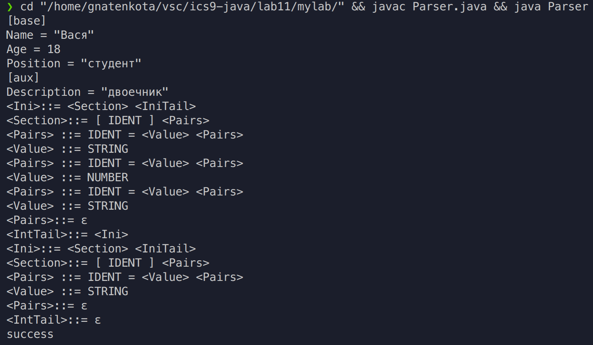
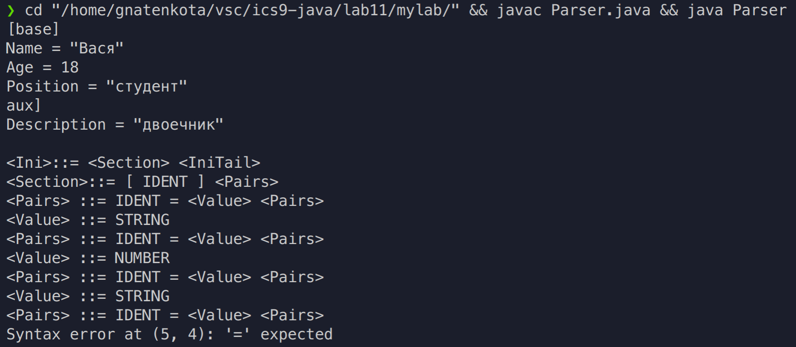

# Цели

Овладение методом рекурсивного спуска для разработки парсеров по грамматике некоторого формального языка.

# Задачи

В ходе лабораторной работы нужно разработать программу, выполняющую синтаксический анализ текста по одной из LL(1)-грамматик, БНФ которых приведены в таблицах 1–6. Текст может содержать символы перевода строки.
	В записи БНФ терминальные символы IDENT, NUMBER и STRING означают идентификаторы, числа и строки, соответственно. Идентификатор – это последовательность букв и цифр, начинающаяся с буквы. Число – это непустая последовательность десятичных цифр. Строка – это обрамлённая кавычками произвольная последовательность символов, не содержащая кавычек и символов перевода строки.
	Программа должна выводить в стандартный поток вывода последовательность правил
грамматики, применение которых даёт левый вывод введённого из стандартного потока ввода текста. Если вывод не может быть построен, программа должна выводить сообщение «syntax error at (line, col)», где line и col – координаты ошибки в тексте.

**`Грамматика:`**
```
<Ini>::= <Section> <IniTail>
<IntTail>::= <Ini> | ε
<Section>::= [ IDENT ] <Pairs>
<Pairs> ::= IDENT = <Value> <Pairs> | ε
<Value> ::= NUMBER | STRING
```

**`Предложение`**
```
[base]
Name = "Вася"
Age = 18
Position = "студент"
[aux]
Description = "двоечник"
```
# Решение

## Исходный код

`Parser.java`

```java
import java.util.Arrays;
import java.util.Scanner;
import java.util.function.IntPredicate;

class Position {
    private String text;
    private int index, line, col;

    public Position(String text) {
        this(text, 0, 1, 1);
    }

    private Position(String text, int index, int line, int col) {
        this.text = text;
        this.index = index;
        this.line = line;
        this.col = col;
    }

    public int getChar() {
        return index < text.length() ? text.codePointAt(index) : -1;
    }

    public boolean satisfies(IntPredicate p) {
        return p.test(getChar());
    }

    public Position skip() {
        int c = getChar();
        switch (c) {
            case -1:
                return this;
            case '\n':
                return new Position(text, index+1, line+1, 1);
            default:
                return new Position(text, index + (c > 0xFFFF ? 2 : 1), line, col+1);
        }
    }

    public Position skipWhile(IntPredicate p) {
        Position pos = this;
        while (pos.satisfies(p)) pos = pos.skip();
        return pos;
    }

    public String toString() {
        return String.format("(%d, %d)", line, col);
    }
}

class SyntaxError extends Exception {
    public SyntaxError(Position pos, String msg) {
        super(String.format("Syntax error at %s: %s", pos.toString(), msg));
    }
}

enum Tag {
    IDENT,
    NUMBER,
    STRING,
    EQUAL,
    LPAREN,
    RPAREN,
    END_OF_TEXT;

    public String toString() {
        switch (this) {
            case IDENT: return "identifier";
            case NUMBER: return "number";
            case STRING: return "string";
            case EQUAL: return "'='";
            case LPAREN: return "'['";
            case RPAREN: return "']'";
            case END_OF_TEXT: return "end of text";
        }
        throw new RuntimeException("unreachable code");
    }
}

class Token {
    private Tag tag;
    private Position start, follow;

    public Token(String text) throws SyntaxError {
        this(new Position(text));
    }

    private Token(Position cur) throws SyntaxError {
        start = cur.skipWhile(Character::isWhitespace);
        follow = start.skip();
        switch (start.getChar()) {
            case -1:
                tag = Tag.END_OF_TEXT;
                break;
            case '[':
                tag = Tag.LPAREN;
                break;
            case ']':
                tag = Tag.RPAREN;
                break;
            case '=':
                tag = Tag.EQUAL;
                break;
            case '"':
                follow = follow.skipWhile(c -> c != '"' && c != '\n' && c != -1);
                if (follow.getChar() != '"') {
                    throw new SyntaxError(follow, "newline in string literal");
                }
                follow = follow.skip();
                tag = Tag.STRING;
                break;
            default:
                if (start.satisfies(Character::isLetter)) {
                    follow = follow.skipWhile(Character::isLetterOrDigit);
                    tag = Tag.IDENT;
                } else if (start.satisfies(Character::isDigit)) {
                    follow = follow.skipWhile(Character::isDigit);
                    if (follow.satisfies(Character::isLetter)) {
                        throw new SyntaxError(follow, "delimiter expected");
                    }
                    tag = Tag.NUMBER;
                } else {
                    throwError("invalid character");
                }
        }
    }

    public void throwError(String msg) throws SyntaxError {
        throw new SyntaxError(start, msg);
    }

    public boolean matches(Tag ...tags) {
        return Arrays.stream(tags).anyMatch(t -> tag == t);
    }

    public Token next() throws SyntaxError {
        return new Token(follow);
    }
}

public class Parser {
    private static Token sym;

    private static void expect(Tag tag) throws SyntaxError {
        if (!sym.matches(tag)) {
            sym.throwError(tag.toString() + " expected");
        }
        sym = sym.next();
    }

    public static void main(String[] args) {
        Scanner in = new Scanner(System.in);
        in.useDelimiter("\\Z");
        String text = in.next();

        try {
            sym = new Token(text);
            parse();
            System.out.println("success");
        }
        catch (SyntaxError e) {
            System.out.println(e.getMessage());
        }
    }

    //<Ini>::= <Section> <IniTail>
    //<IntTail>::= <Ini> | ε
    //<Section>::= [ IDENT ] <Pairs>
    //<Pairs> ::= IDENT = <Value> <Pairs> | ε
    //<Value> ::= NUMBER | STRING

    private static void parse() throws SyntaxError {
        parseIni();
        expect(Tag.END_OF_TEXT);
    }

    private static void parseIni() throws SyntaxError {
        if (sym.matches(Tag.LPAREN)) {
            System.out.println("<Ini>::= <Section> <IniTail>");
            parseSection();
            parseIniTail();
        } else {
            sym.throwError("[ expected");
        }
    }

    private static void parseIniTail() throws SyntaxError {
        if (sym.matches(Tag.LPAREN)) {
            System.out.println("<IntTail>::= <Ini>");
            parseIni();
        } else {
            System.out.println("<IntTail>::= ε");
        }
    }

    private static void parseSection() throws SyntaxError {
        if (sym.matches(Tag.LPAREN)) {
            System.out.println("<Section>::= [ IDENT ] <Pairs>");
            sym = sym.next();
            expect(Tag.IDENT);
            expect(Tag.RPAREN);
            parsePairs();
        } else {
            sym.throwError("[ expected");
        }
    }

    private static void parsePairs() throws SyntaxError {
        if (sym.matches(Tag.IDENT)) {
            System.out.println("<Pairs> ::= IDENT = <Value> <Pairs>");
            sym = sym.next();
            expect(Tag.EQUAL);
            parseValue();
            parsePairs();
        } else {
            System.out.println("<Pairs>::= ε");
        }
    }

    private static void parseValue() throws SyntaxError {
        if (sym.matches(Tag.NUMBER)) {
            System.out.println("<Value> ::= NUMBER");
            sym = sym.next();
        } else if (sym.matches(Tag.STRING)) {
            System.out.println("<Value> ::= STRING");
            sym = sym.next();
        } else {
            sym.throwError("number or string expected");
        }
    }
}

```

## Вывод



