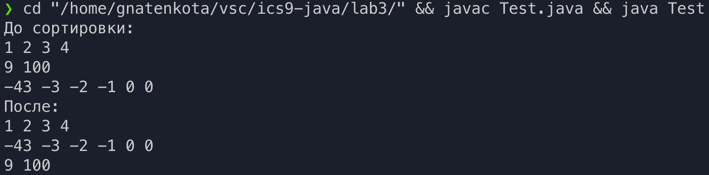

# Цели

Приобретение навыков реализации интерфейсов для обеспечения возможности
полиморфной обработки объектов класса.

# Задачи

Класс последовательностей целых чисел с порядком на
основе разности максимального и минимального числа.

# Решение

## Исходный код

`Test.java`

```java
import java.util.Arrays;
public class Test {
    public static void main(String[] args) {
        Sequencing[] A = new Sequencing[] {
            new Sequencing(new int[]{1,2,3,4}),
            new Sequencing(new int[]{9, 100}),
            new Sequencing(new int[]{-43, -3, -2, -1, 0, 0})
        };
        System.out.println("До сортировки:");
        for (Sequencing s : A) System.out.println(s.toString());
        Arrays.sort(A);
        System.out.println("После:");
        for (Sequencing s : A) System.out.println(s.toString());
    }
}

```

`Series.java`

```java
public class Sequencing implements Comparable<Sequencing>{
    private int[] seq;
    public Sequencing(int[]seq) {this.seq = seq;}
    public int difference(){
        if ((seq.length == 0) | (seq.length == 1)) return 0;
        int min = seq[0], max = seq[0];
        for(int i = 1; i < seq.length; i++){ 
            if (seq[i] > max) max = seq[i];
            if (seq[i] < min) min = seq[i];
        }
        return max - min;
    }
    
    public int compareTo(Sequencing obj) {
        if (difference() < obj.difference()) return -1;
        if (difference() == obj.difference()) return 0;
        return 1;
    }
    public String toString(){
        String str = "";
        for (int x : seq) str += x + " ";
        return str;
    }
}

```

## Пример вывода

