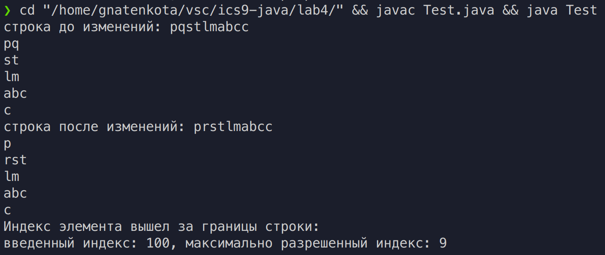

# Цели

Изучение обобщённых итераторов и экземплярных вложенных классов языка Java. 

# Задачи

Строка, составленная из маленьких латинских букв, с итератором по максимальным подстрокам, в которых буквы идут в алфавитном порядке.

# Решение

## Исходный код

**`SubstringList.java`**

```java
import java.util.Iterator;
public class SubstringList implements Iterable<String>{
    private StringBuilder str;

    public SubstringList(StringBuilder s){
        str = s;
    }

    public void setElem(int index, char elem){
        if (index >= str.length()){
            System.out.println("Индекс элемента вышел за границы строки:\nвведенный индекс: " + index + ", максимально разрешенный индекс: " + (str.length() - 1));
        }else{
            str.setCharAt(index, elem);
        }
    }

    public Iterator<String> iterator(){
        return new SubstringIterator();
    }

    private class SubstringIterator implements Iterator<String>{
        private int pos;
        
        public SubstringIterator(){
            pos = 0;
        }

        public boolean hasNext(){
            return pos < str.length();
        }

        public String next(){
            int pos1 = pos;
            int len = str.length();
            for (boolean flag = true; pos < len - 1 && flag; pos++) {
                if (str.charAt(pos) != str.charAt(pos + 1) - 1){
                    flag = !flag;
                    pos--;
                }
            }
            pos++;
            return str.substring(pos1, pos);
        }
    }
}

```

**`Test.java`**

```java
public class Test {
    public static void main(String[] args) {
        StringBuilder str = new StringBuilder("pqstlmabcc");
        SubstringList substrs = new SubstringList(str);
        System.out.println("строка до изменений: " + str);
        for (String s : substrs) System.out.println(s);
        substrs.setElem(1, 'r');//str.insert(1, 'r');
        System.out.println("строка после изменений: " + str);
        for (String s : substrs) System.out.println(s);
        substrs.setElem(100, 'r');
    }
}

```

## Вывод

