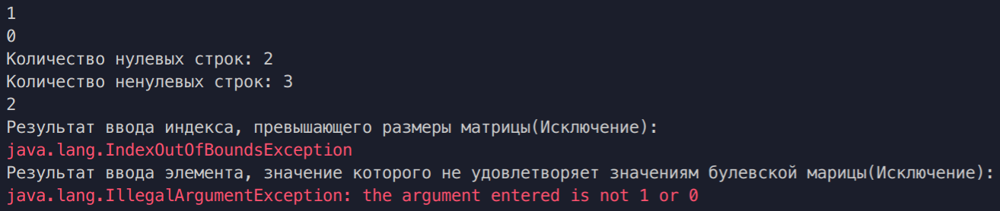

# Цели

Приобретение навыков использования монад Optional и Stream в программах на языке Java.

# Задачи

Во время выполнения лабораторной работы требуется разработать на языке Java один из классов, перечисленных в таблице, которая приведена ниже. 
	В каждом классе нужно реализовать по крайней мере два метода: первый метод должен возвращать Stream, а второй – Optional. Операции, выполняемые каждым методом, указаны в вариантах задания. 
	В методе main вспомогательного класса Test нужно продемонстрировать работоспособность разработанного класса, осуществив группировку содержимого потока, возвращаемого первым методом, с помощью группирующего коллектора. 
	В исходном коде (включая класс Test) запрещено использовать циклы и рекурсию.  

Булевская матрица размером **`m × n`**, где **`1 ≤ m`**, **`n ≤ 8`**, с операциями: 

1. порождение потока сумм элементов строк по модулю 2 (т.е., исключающее ИЛИ); 
2. поиск строки, в которой единиц больше, чем во всех остальных строках вместе взятых. Элементы матрицы должны быть представлены битами в числе типа long. 

Проверить работу первой операции нужно путём подсчёта количества нулевых и ненулевых сумм. 

# Решение

## Исходный код

**`Matrix.java`**

```java

import java.util.ArrayList;
import java.util.Arrays;
import java.util.Comparator;
import java.util.Optional;
import java.util.stream.Collectors;
import java.util.stream.IntStream;
import java.util.stream.Stream;

public class Matrix {
    private int m, n;
    private long x;
    private int[] rowSums;

    public String getX() {
        return Long.toBinaryString(x);
    }

    public Matrix(int m, int n){
        this.m = m;
        this.n = n;
        x = 0;
        rowSums = new int[m];
    }

    public int getM() {
        return m;
    }

    public long getElem(int i, int j){
        try {
            if (i >= n || j >= m){
                throw new IndexOutOfBoundsException();
            }
            return  (x&1<<(i*n+j))>>(i*n+j);
        } catch (Exception e) {
            System.out.println(e);
            return -1;
        }
    }

    public void setElem(int i, int j, int elem){
        try {
            if (i >= n || j >= m){ throw new IndexOutOfBoundsException();}
            if (elem!=1 && elem!=0){throw new IllegalArgumentException("the argument entered is not 1 or 0");}

            if (elem == 1 && getElem(i, j) == 0) {
                rowSums[i] += 1;
            }
            if (elem == 0 && getElem(i, j) == 1) {
                rowSums[i] -= 1;
            }
            x |= (elem<<(i*n+j));
            
        } catch (Exception e) {
            System.out.println("\u001B[31m" + e + "\u001B[0m");
        }
    }

    public ArrayList<Integer> arrayStream(){
        return new ArrayList<>(Arrays.stream(rowSums).boxed().collect(Collectors.toList()));
    }
    public Stream<Integer> sumStream(){
        ArrayList<Integer> result = new ArrayList<>();
        ArrayList<Integer> temp = arrayStream();
        temp.stream().forEach(x -> result.add(x % 2));
        return result.stream();
    }

    public Optional<Integer> getString(){
        Optional<Integer> result = Optional.empty();
        ArrayList<Integer> temp = arrayStream();
        Optional<Integer> temp2 =  IntStream.range(0, temp.size()).boxed().max(Comparator.comparing(temp::get));
        if (temp2.isPresent()){
            result = Optional.ofNullable(temp2.get());
        }
        return result;
    }

    public int countZero(){
        return (int)arrayStream().stream().filter(x -> x == 0).count();
    }

}

```

**`Test.java`**

```java

public class Test {
    public static void main(String[] args) {
        Matrix test = new Matrix(5, 4);
        test.setElem(2, 4, 1);
        test.setElem(0, 1, 1);
        test.setElem(2, 2, 1);
        test.setElem(2, 3, 1);
        test.setElem(3, 1, 1);
        //System.out.println(test.getX());
        System.out.println(test.getElem(0, 1));
        System.out.println(test.getElem(0, 3));
        System.out.println("Количество нулевых строк: " + test.countZero());
        System.out.println("Количество ненулевых строк: " + (test.getM() - test.countZero()));
        System.out.println(test.getString().get());
        System.out.println("Результат ввода индекса, превышающего размеры матрицы(Исключение):");
        test.setElem(7, 1, 1);
        System.out.println("Результат ввода элемента, значение которого не удовлетворяет значениям булевской марицы(Исключение):");
        test.setElem(2, 1, 3);
    }
}

```
## Вывод

