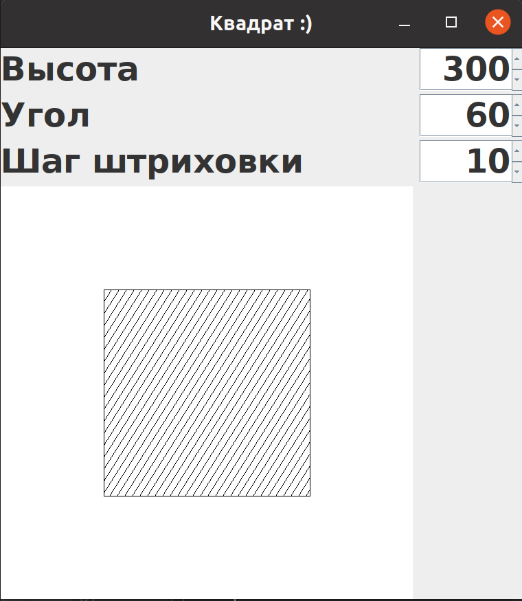
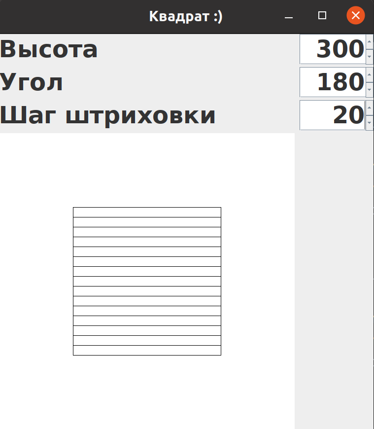

# Цели

Приобретение навыков разработки программ с графическим пользовательским интерфейсом на основе библиотеки swing.

# Задачи

Квадрат со стороной a, по желанию пользователя заштрихованный под углом x градусов с шагом d.

# Решение

## Исходный код

`PictureForm.java`

```java
import javax.swing.*;
import javax.swing.event.ChangeEvent;
import javax.swing.event.ChangeListener;

public class PictureForm {
    private JPanel mainPanel;
    private JSpinner heightSpinner;
    private CanvasPanel canvasPanel;
    private JSpinner angleSpinner;
    private JSpinner deltaSpinner;

    public PictureForm() {
        heightSpinner.setValue(300);
        deltaSpinner.setValue(10);
        angleSpinner.setValue(60);
        heightSpinner.addChangeListener(new ChangeListener() {
            @Override
            public void stateChanged(ChangeEvent e) {
                int height = (int) heightSpinner.getValue();
                canvasPanel.setHeight(height);
            }
        });
        angleSpinner.addChangeListener(new ChangeListener() {
            @Override
            public void stateChanged(ChangeEvent e) {
                int angle = (int) angleSpinner.getValue();
                canvasPanel.setAngle(angle);
            }
        });
        deltaSpinner.addChangeListener(new ChangeListener() {
            @Override
            public void stateChanged(ChangeEvent e) {
                int delta = (int) deltaSpinner.getValue();
                canvasPanel.setDelta(delta);
            }
        });
    }

    public static void main(String[] args) {
        JFrame frame = new JFrame("Квадрат :)");
        frame.setContentPane(new PictureForm().mainPanel);
        frame.setDefaultCloseOperation(JFrame.EXIT_ON_CLOSE);
        frame.pack();
        frame.setVisible(true);
    }
}

```

**`CanvasPanel.java`**

```java
import javax.swing.*;
import java.awt.*;

public class CanvasPanel extends JPanel {
    private  int a = 300;
    private double angle = 1;
    private int delta = 10;

    public void setHeight(int inA){
        a = inA;
        repaint();
    }

    public void setAngle(double angle) {
        this.angle = Math.toRadians(angle);
        repaint();
    }

    public void setDelta(int delta) {
        this.delta = delta;
        repaint();
    }

    @Override
    protected void paintComponent(Graphics g){
        super.paintComponent(g);
        int b = (600 - a)/2;
        g.setColor(Color.BLACK);
        g.drawRect(b, b, a, a);
        double tan = Math.tan(angle);
        if (angle % Math.PI == 0){
            for (int y1 = b; y1 < b + a; y1 += delta) {
                g.drawLine(b, y1, b + a, y1);
            }
        }else {
            double delta1 = (double)(delta / Math.abs(Math.sin(angle)));
            int x = (int) Math.round(a / tan);
            if ((angle > Math.PI / 2) && (angle < Math.PI) || angle > 3 * Math.PI / 2) {
                for (int x1 = b + x, x2 = b; x1 < b + a; x1 += delta1, x2 += delta1) {
                    g.drawLine(x1, b, x2, b + a);
                }
            } else {
                for (int x1 = b - x, x2 = b; x1 < b + a; x1 += delta1, x2 += delta1) {
                    g.drawLine(x1, b + a, x2, b);
                }
            }
        }
        g.setColor(Color.WHITE);
        g.fillRect(0, b, b, a + 1);
        g.fillRect(b + a + 1, b, b, a + 1);
    }
}

```

## Вывод






