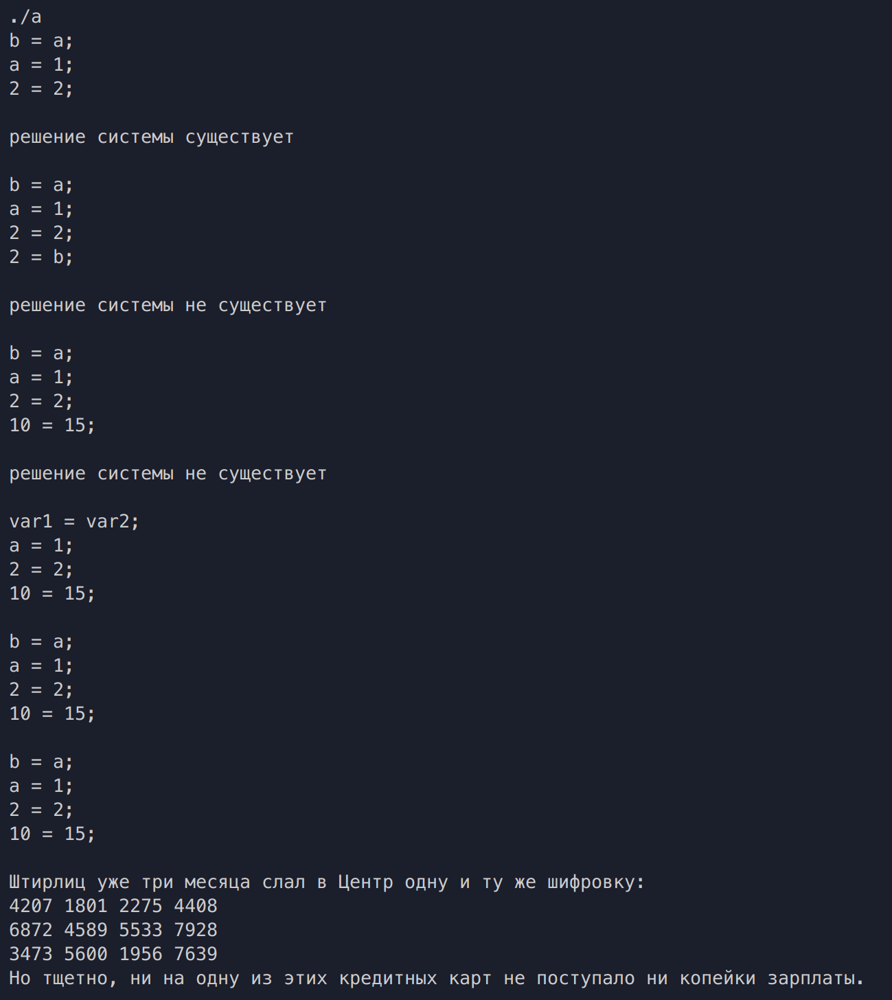

# Цели

Целью данной работы является изучение базовых объектно-ориентированных
возможностей языка C++.

# Задачи

Выполнение лабораторной работы заключается в составлении на языке C++
программы, состоящей из трёх файлов:

- заголовочный файл **`declaration.h`** с объявлением одного из классов,
приведённых в таблицах 1 – 16;
- файл **`implementation.cpp`** с определениями методов класса;
- файл **`main.cpp`**, содержащий функцию main и, возможно, вспомогательные
функции для проверки работоспособности класса.

Реализация класса не должна опираться на стандартные контейнерные классы
C++, то есть внутреннее состояние объектов класса должно быть реализовано через обычные
массивы. Соответственно, в классе обязательно требуется реализовать:

- конструктор копий;
- деструктор (должен быть объявлен виртуальным);
- операцию присваивания.

Проверку работоспособности класса требуется организовать в функции `main`,
размещённой в файле **`main.cpp.`**
Проверка должна включать в себя:

- создание объекта класса в автоматической памяти;
- передачу объекта класса по значению в функцию;
- присваивание объекта класса переменной.

## Формулировка задачи

Система равенств вида **`a = b`**, где как **a**, так и **b** может быть либо именем переменной, либо целым числом. Для системы должны быть реализованы операции: 

  1. получение ссылки на **i**-тое равенство; 
  2. добавление нового равенства; 
  3. проверка, существует ли решение системы. 

\vspace{10cm}

# Решение

## Исходный код

**`Declaration.h`**

```cpp
#include <string>
#include <climits>

class EquasionsSet
{
public:
    class Equasion {
        private:
            int a, b;
            std::string str_a, str_b;
        public:
        Equasion(std::string a, int b);        //
        Equasion(int a, std::string b);        // конструктор
        Equasion(int a, int b);                //   равенства
        Equasion(std::string a, std::string b);//
        Equasion& operator=(const Equasion& obj);
        Equasion(const Equasion& obj);
        void printA();
        void printB();
        int aGet();
        int bGet();
        std::string str_aGet();
        std::string str_bGet();
        std::string* str_aG();
        std::string* str_bG();

    };
private:
    size_t n;
    EquasionsSet::Equasion** array;
public:
    size_t getN();
    EquasionsSet(size_t n);//конструктор системы         +
    EquasionsSet(const EquasionsSet& obj);// конструктор копий    +
    ~EquasionsSet();//деструктор    
    EquasionsSet& operator=(const EquasionsSet& obj);//операция присваивания   +
    EquasionsSet::Equasion*& operator[](int i);//полученте ссылки на i-тое равенство  
    void add(Equasion& eq);//добавление нового равенства
    bool checkForSolution(); //проверка существует ли решение системы
};

```

**`Implementation.cpp`**

```cpp
#include "declaration.h"
#include <algorithm>
#include <iostream>
#include <cstdlib>

//Equasion
EquasionsSet::Equasion::Equasion(std::string a, int b):str_a(a),b(b),str_b(""),a(INT_MIN){}
EquasionsSet::Equasion::Equasion(int a, std::string b):a(a),str_b(b),b(INT_MIN),str_a(""){}
EquasionsSet::Equasion::Equasion(int a, int b):a(a),b(b),str_a(""),str_b(""){}
EquasionsSet::Equasion::Equasion(std::string a, std::string b):str_a(a),str_b(b),a(INT_MIN),b(INT_MIN){}
EquasionsSet::Equasion::Equasion(const Equasion& obj):a(obj.a), b(obj.b){
    str_a = obj.str_a;
    str_b = obj.str_b;
}

int EquasionsSet::Equasion::aGet(){return a;}
int EquasionsSet::Equasion::bGet(){return b;}
std::string EquasionsSet::Equasion::str_aGet(){return str_a;}
std::string EquasionsSet::Equasion::str_bGet(){return str_b;} 
std::string* EquasionsSet::Equasion::str_aG(){return &str_a;}
std::string* EquasionsSet::Equasion::str_bG(){return &str_b;} 

void EquasionsSet::Equasion::printA(){
    if (a != INT_MIN){std::cout<<a;}
    if (str_a != ""){std::cout<<str_a;}
}

void EquasionsSet::Equasion::printB(){
    if (b != INT_MIN){std::cout<<b<<";\n";}
    if (str_b != ""){std::cout<<str_b<<";\n";}
}

EquasionsSet::Equasion& EquasionsSet::Equasion::operator=(const Equasion& obj){
    if(this != &obj){
       a = obj.a;
       b = obj.b;
       str_a = obj.str_a;
       str_b = obj.str_b;
    }
    return *this; 
}

//EquasionsSet
EquasionsSet::EquasionsSet(size_t n):n(n){
    array = new Equasion* [n];          
}

size_t EquasionsSet::getN(){return n;}

EquasionsSet::EquasionsSet(const EquasionsSet& obj): n(obj.n){
    this->array = new EquasionsSet::Equasion* [n];
    std::copy(obj.array, obj.array + n, this->array);
}

EquasionsSet::~EquasionsSet()
{
    delete [] array;
    //std::cout<<"kill\n";
}

EquasionsSet& EquasionsSet::operator=(const EquasionsSet& obj){
    if(this != &obj){
        n = obj.n;        
        delete [] array;        
        array = new Equasion* [n];        
        std::copy(obj.array, obj.array + n, this->array);
    }
    return *this; 
}

EquasionsSet::Equasion*& EquasionsSet::operator[](int i){
    return array[i];
}

void EquasionsSet::add(EquasionsSet::Equasion& obj){
    auto ar = new EquasionsSet::Equasion* [n];
    std::copy(array, array + n, ar);
    delete [] this->array;
    this->array = new EquasionsSet::Equasion* [n + 1];
    std::copy(ar, ar + n, this->array);
    array[n] = &obj;
    this->n++;
    delete [] ar;
}

int comp (const void* vn1, const void* vn2){
    auto n1 = (EquasionsSet::Equasion*) vn1;
    auto n2 = (EquasionsSet::Equasion*) vn2;

    int count1 = (n1->str_aGet() != ""? 1 : 0) + (n1->str_bGet() != ""? 1 : 0);
    int count2 = (n2->str_aGet() != ""? 1 : 0) + (n2->str_bGet() != ""? 1 : 0);

    return count2 - count1;
}

bool EquasionsSet::checkForSolution(){
    std::sort(array, array + n, comp);
    std::string* var = new std::string[n];
    int value[n], vn = 0;
    for (size_t i = 0; i < this->n; i++){
        if (array[i]->aGet() != INT_MIN && array[i]->bGet() != INT_MIN){
            if (array[i]->aGet() != array[i]->bGet()){
                delete [] var;
                return false;
                }
        }
        if (array[i]->aGet() != INT_MIN && array[i]->str_bGet() != ""){
            bool flag = true;
            for (size_t j = 0; j < vn && flag; j++){
                if (var[j] == array[i]->str_bGet()){
                    if (array[i]->aGet() != value[j]){
                        delete [] var;
                        return false;}
                    flag = !flag;
                }
            }
            if(flag){
                var[vn] = *array[i]->str_bG();
                value[vn] = array[i]->aGet();
                vn++;
            }
        }
        if (array[i]->str_aGet() != "" && array[i]->bGet() != INT_MIN){
            bool flag = true;
            for (size_t j = 0; j < vn && flag; j++){
                if (var[j] == *array[i]->str_aG()){
                    if (array[i]->bGet() != value[j]){
                        delete [] var;
                        return false;}
                    flag = !flag;
                }
            }
            if(flag){
                var[vn] = *array[i]->str_aG();
                value[vn] = array[i]->bGet();
                vn++;
            }
        }
        if (array[i]->str_aGet() != "" && array[i]->str_bGet() != ""){
            int a = 0;
            bool flag = true;
            bool flag1 = false;
            for (size_t j = 0; j < vn && flag; j++){
                if (var[j] == *array[i]->str_aG()){
                    a = value[j];
                    flag = !flag;
                }
            }
            if(flag){flag1 = true;}
            flag = true;
            for (size_t j = 0; j < vn && flag; j++){
                if (var[j] == *array[i]->str_bG()){
                    if(!flag1){
                        if (a != value[j]){
                            delete [] var;
                            return false;
                            }
                    }else{
                        value[vn] = value[j];
                        vn++;
                    }
                    flag = !flag;
                }
            }
            if(flag){
                var[vn] = *array[i]->str_bG();
                value[vn] = a;
                vn++;
            }
        }
    }
    delete [] var;
    return true;
}

```

**`Main.cpp`**

```cpp
#include <iostream>
#include "declaration.h"

using namespace std;

void printEq(EquasionsSet::Equasion* eq){
    eq->printA();
    std::cout<<" = ";
    eq->printB();
}

void display(EquasionsSet eqSet){
    for (size_t i = 0; i < eqSet.getN(); i++)
    {
        printEq(eqSet[i]);
    }
    std::cout<<"\n";
}

void foo(EquasionsSet set){
    if (set.EquasionsSet::checkForSolution()){
        std::cout<<"решение системы существует\n\n";
    }else{
        std::cout<<"решение системы не существует\n\n";
    }
}

void foo1(EquasionsSet set){
    EquasionsSet::Equasion f("var1", "var2");
    set[0] = &f;
    display(set);
}

int main()
{
    EquasionsSet test(3);
    EquasionsSet::Equasion a("b", "a");
    EquasionsSet::Equasion b("a", 1);
    EquasionsSet::Equasion c(2, 2);
    EquasionsSet::Equasion d(2, "b");
    EquasionsSet::Equasion f(10, 15);
    test[0] = &a;
    test[1] = &b;
    test[2] = &c;
    display(test);
    foo(test);
    
    test.add(d);
    display(test);
    foo(test);

    test[3] = &f;
    display(test);
    foo(test);

    foo1(test); //проверка работы конструктора копий
    display(test);
    
    EquasionsSet t(2);
    t = test;   //операция присваивания
    display(t);
    return 0;
}

```

\vspace{10cm}

## Вывод




