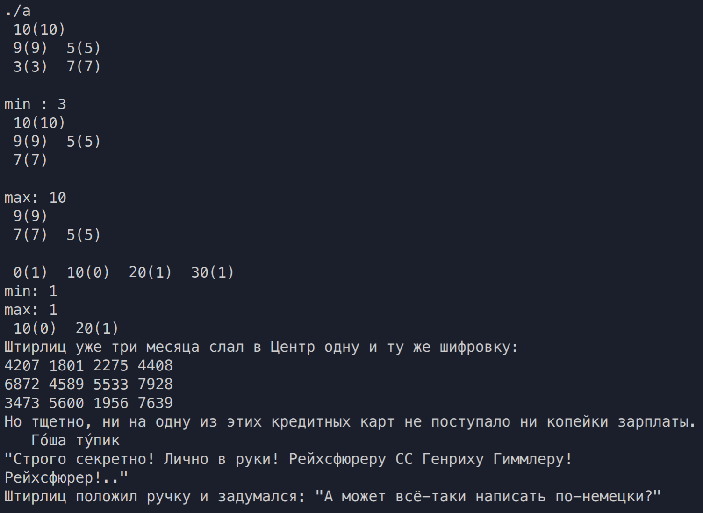

# Цели

Целью данной работы является изучение шаблонов классов языка C++. 

# Задачи

**`PQueue<T, N>`** – очередь с приоритетом максимального размера **`N`** с элементами типа **`T`**, имеющая одновременно операцию удаления максимального элемента и операцию удаления минимального элемента. Указанные операции должны работать за логарифмическое время. В **`PQueue<bool, N>`** все операции должны работать за константное время.

# Решение

## Исходный код

**`PQueue.hpp`**

```cpp

#ifndef PQUEUE_H
#define PQUEUE_H

#include <cstdlib>
#include <climits>
#include <iostream>
#include <queue>
#include <algorithm>
#include <set>

template<
    class T,
    class Container = std::vector<T>,
    class Compare = std::less<typename Container::value_type>
> class my_priority_queue: public std::priority_queue<T, Container, Compare>{
public:

    void print(){
        int x = 0;
        size_t capacity = this->c.size();
        for (int i = 1; (size_t)i <= capacity; i*=2)
        {
            for (int j = 0; j < i && size_t(x)<capacity; j++)
            {
                this->c[x++].print();
            }
            std::cout << "\n";
        }
        std::cout << "\n";
    }

    bool remove(const T& value) {
        auto it = std::find(this->c.begin(), this->c.end(), value);
        if (it != this->c.end()) {
            this->c.erase(it);
            std::make_heap(this->c.begin(), this->c.end(), this->comp);
            return true;
        }
        else {
            return false;
        }
    }
};

template <typename T, size_t N>
class PQueue
{
    struct Elem
    {
        T value;
        int priority;
        void print(){
            std::cout << " "<< priority << "(" << value << ") ";
        }
        friend bool operator< (Elem const& lhs, Elem const& rhs) {
            return lhs.priority < rhs.priority;
        }
        friend bool operator> (Elem const& lhs, Elem const& rhs) {
            return lhs.priority > rhs.priority;
        }
        friend bool operator== (Elem const& lhs, Elem const& rhs) {
            return (lhs.priority == rhs.priority) && (lhs.value == rhs.value);
        }
    };
private:
    size_t count;
    my_priority_queue<Elem> PQueueMax;
    my_priority_queue<Elem,std::vector<Elem>, std::greater<Elem> > PQueueMin;
public:
    PQueue();
    T extractMax();
    T extractMin();
    void insert(T v, int p);
    void print();
};

template <typename T, size_t N> 
PQueue<T, N>::PQueue(){
    PQueueMax = {};
    PQueueMin = {};
    count = 0;
}

template <typename T, size_t N> 
T PQueue<T, N>::extractMin(){
    Elem res = PQueueMin.top();
    PQueueMin.pop();
    PQueueMax.remove(res);
    count--;
    return res.value;
}

template <typename T, size_t N> 
T PQueue<T, N>::extractMax(){
    Elem res = PQueueMax.top();
    PQueueMax.pop();
    PQueueMin.remove(res);
    count--;
    return res.value;
}

template <typename T, size_t N>
void PQueue<T, N>::insert(T v, int p){
    Elem temp = {v, p};
    PQueueMax.push(temp);
    PQueueMin.push(temp);
    count++;
}

template<typename T, size_t N>
void PQueue<T, N>::print(){
    PQueueMax.print();
}

template <size_t N>
class PQueue<bool, N>{
    struct Elem
    {
        bool value;
        int priority;
        void print(){
            std::cout << " "<< priority << "(" << value << ") ";
        }
        friend bool operator< (Elem const& lhs, Elem const& rhs) {
            return lhs.priority < rhs.priority;
        }
        friend bool operator> (Elem const& lhs, Elem const& rhs) {
            return lhs.priority > rhs.priority;
        }
        friend bool operator== (Elem const& lhs, Elem const& rhs) {
            return (lhs.priority == rhs.priority) && (lhs.value == rhs.value);
        }
    };
private:
    std::multiset<Elem> PQueueB;
public:
    PQueue();
    bool extractMax();
    bool extractMin();
    void insert(bool v, int p);
    void print();

};


template <size_t N>
PQueue<bool, N>::PQueue(){
    PQueueB = {};
}

template <size_t N>
void PQueue<bool, N>::insert(bool v, int p){
    PQueueB.insert(Elem{v, p});
}

template <size_t N>
bool PQueue<bool, N>::extractMax(){
    typename std::multiset<Elem>::reverse_iterator iter;
    iter = PQueueB.rbegin();
    bool max = (*iter).value;
    PQueueB.erase(*iter);
    return max;
    //return (*PQueueB.rbegin()).value;
}

template <size_t N>
bool PQueue<bool, N>::extractMin(){
    typename std::multiset<Elem>::iterator iter;
    iter = PQueueB.begin();
    bool min = (*iter).value;
    PQueueB.erase(*iter);
    return min;
}

template <size_t N>
void PQueue<bool, N>::print(){
    for(auto elem : PQueueB){
        elem.print();
    }
    std::cout<< "\n";

}


#endif

```

**`main.cpp`**

```cpp
#include <iostream>
#include "PQueue.hpp"

using namespace std;

int main()
{
    PQueue<int, 10> test;
    test.insert(3, 3);
    test.insert(5, 5);

    test.insert(7, 7);
    test.insert(9, 9);
    test.insert(10, 10);
    test.print();
    std::cout<< "min : "<< test.extractMin()<<"\n";
    test.print();
    std::cout<< "max: " <<test.extractMax()<<"\n";
    test.print();

    PQueue<bool, 10> test_bool;
    test_bool.insert(false, 10);
    test_bool.insert(true, 0);
    test_bool.insert(true, 20);
    test_bool.insert(true, 30);
    test_bool.print();
    //std::cout<< "max: " <<test_bool.extractMax()<<"\n";
    std::cout<< "min: " <<test_bool.extractMin()<<"\n";
    std::cout<< "max: " <<test_bool.extractMax()<<"\n";
    test_bool.print();
    return 0;
}

```

\vspace{5cm}

## Вывод


