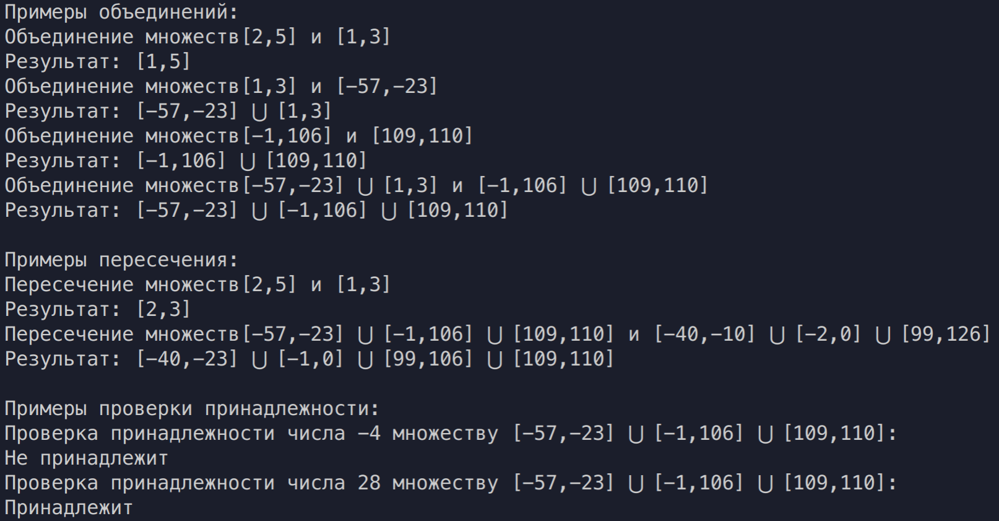

# Цели

Данная работа предназначена для изучения возможностей языка C++, обеспечивающих применение знаков операций к объектам пользовательских типов. 

# Задачи

**`NumSet<T>`** – множество чисел, имеющих тип **`T`**.
Конструктор класса **`NumSet<T>`** принимает в качестве параметров границы интервала **`[a, b]`** и формирует множество, содержащее числа,
принадлежащие этому интервалу. Подразумевается, что более сложные множества могут быть сконструированы с помощью
перегруженных операций. Операции, перегружаемые для **`NumSet<T>`**:

  1. «∗» и «+» – пересечение и объединение двух множеств, соответственно;
  2. «( )» – проверка принадлежности значения типа T множеству.

# Решение

## Исходный код

**`NumSet.hpp`**

```cpp

#ifndef NUMSET_H
#define NUMSET_H

#include <cstdlib>
#include <iostream>
#include <vector>
#include <bits/stdc++.h>

template <typename T>
class NumSet{

    struct Interval
    {
        T begin, end;
        Interval& operator=(const Interval& obj) {
            begin = obj.begin;
            end = obj.end;
            return *this;
        }
        friend bool operator< (Interval const& lhs, Interval const& rhs) {
            return lhs.begin < rhs.begin;
        }
    };

private:
    std::vector<Interval> numset;
    
public:
    NumSet(T a, T b){
        numset.emplace_back(Interval{a, b});
    };

    NumSet(){
        numset = {};
    };

    NumSet& operator=(const NumSet& obj){
        this->numset = obj.numset;
        return *this;
    };

    NumSet operator*(const NumSet obj){
        NumSet res;
        for (auto a : this->numset)
        {
            for (auto b : obj.numset){
                if (!(a.end < b.begin || a.begin > b.end)){
                    if (a.begin <= b.begin && a.end >= b.begin && a.end <= b.end){res.numset.push_back(Interval{b.begin, a.end});}
                    if (a.begin >= b.begin && a.end <= b.end){res.numset.push_back(Interval{a.begin, a.end});}
                    if (a.begin <= b.begin && a.end >= b.end){res.numset.push_back(Interval{b.begin, b.end});}
                    if (a.begin >= b.begin && a.begin <= b.end && a.end >= b.end){res.numset.push_back(Interval{a.begin, b.end});}
                }
            }
        }
        return res;
    };

    NumSet operator+(const NumSet obj){
        NumSet res;
        std::vector<Interval> r;
        res.numset = this->numset;
        for (auto b : obj.numset)
        {
            bool flag = true;
            for (auto &a : res.numset){
                if (!(a.end < b.begin || a.begin > b.end)){
                    if (a.begin <= b.begin && a.end >= b.begin && a.end <= b.end){a = Interval{a.begin, b.end};}
                    if (a.begin >= b.begin && a.end <= b.end){a = Interval{b.begin, b.end};}
                    if (a.begin <= b.begin && a.end >= b.end){a = Interval{a.begin, a.end};}
                    if (a.begin >= b.begin && a.begin <= b.end && a.end >= b.end){a = Interval{b.begin, a.end};}
                    flag = false;
                }
            }
            if (flag){r.push_back(b);}
        }
        for (auto b : r){
            res.numset.push_back(b);
        }
        sort(res.numset.begin(), res.numset.end());
        return res;
    };

    bool operator()(T num){
        for (auto interval : this->numset)
        {
            if (num >= interval.begin && num <= interval.end){return true;}
        }
        return false;
        
    };

    void print();
};

template <typename T>
void NumSet<T>::print(){
    int i = 0;
    for (auto interval : numset)
    {
        if (i++ != 0){std::cout << " ⋃ ";}
        std::cout << "[" << interval.begin << ',' << interval.end << "]";
    }
    
}

#endif

```
**`main.cpp`**

```cpp
#include <cstdlib>
#include <iostream>
#include "NumSet.cpp"

template <typename T>
void printAdd(NumSet<T> a, NumSet<T> b, NumSet<T> c){
    std::cout<< "Объединение множеств";
    a.print();
    std::cout<< " и ";
    b.print();
    std::cout<<"\nРезультат: ";
    c.print();
    std::cout<<"\n";
}

template <typename T>
void printMul(NumSet<T> a, NumSet<T> b, NumSet<T> c){
    std::cout<< "Пересечение множеств";
    a.print();
    std::cout<< " и ";
    b.print();
    std::cout<<"\nРезультат: ";
    c.print();
    std::cout<<"\n";
}

template <typename T>
void printIs(NumSet<T> a, T elem){
    std::cout<< "Проверка принадлежности числа " << elem;
    std::cout<< " множеству ";
    a.print();
    if (a(elem)){
        std::cout<<":\nПринадлежит\n";
    }else{std::cout<<":\nНе принадлежит\n";}
}

int main()
{   
    NumSet<int> test1(2, 5);
    NumSet<int> test2(1, 3);
    NumSet<int> test3(-1, 106);
    NumSet<int> test4(109, 110);
    NumSet<int> test5(-57, -23);

    std::cout<<"Примеры объединений:\n";
    NumSet<int> test6 = test1+test2;
    printAdd(test1, test2, test6);
    NumSet<int> test7 = test2+test5;
    printAdd(test2, test5, test7);
    NumSet<int> test8 = test3+test4;
    printAdd(test3, test4, test8);
    NumSet<int> test9 = test7+test8;
    printAdd(test7, test8, test9); 

    std::cout<<"\nПримеры пересечения:\n";
    NumSet<int> test10 = test1*test2;
    printMul(test1, test2, test10);
    NumSet<int> test_1(-40, -10);
    NumSet<int> test_2(99, 126);
    NumSet<int> test_3(-2, 0);
    NumSet<int> test_4 = (test_1+test_2)+test_3;
    NumSet<int> test_5 = test9*test_4;

    printMul(test9, test_4, test_5);

    std::cout<<"\nПримеры проверки принадлежности:\n";
    printIs(test9, -4);
    printIs(test9, 28);
    

    return 0;
}
```
## Вывод


