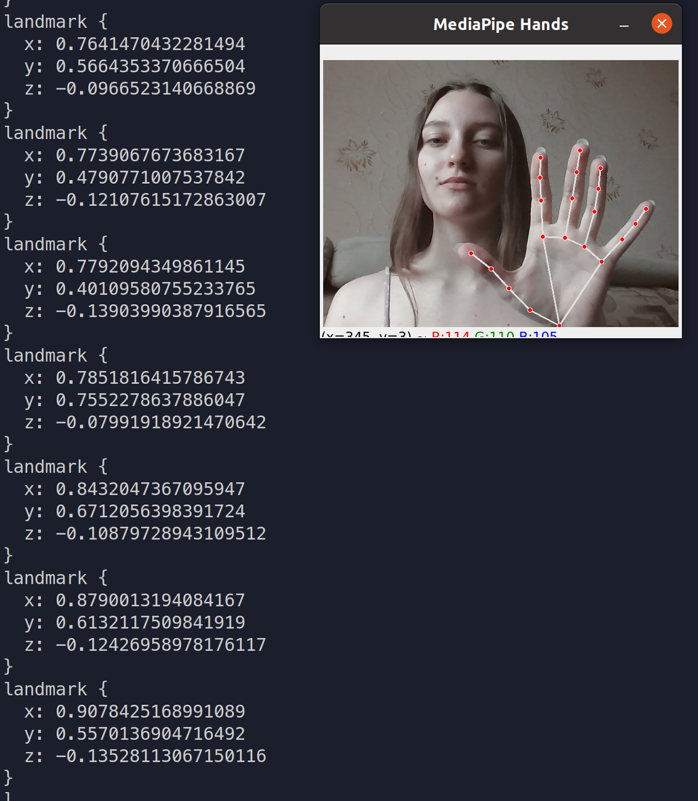

# Цели

Знакомство с возможностями языка Python и библиотеки OpenCV для реализации задач машинного зрения.

# Задачи

Реализовать пример на Python 
https://google.github.io/mediapipe/solutions /hands.html#python-solution-api, координаты точек выводятся списком в консоль. Продемонстрировать работу приложения.

# Решение

## Исходный код

**`Module1_PipeHands.py`**

```py
import cv2
import mediapipe as mp

mp_drawing = mp.solutions.drawing_utils
mp_hands = mp.solutions.hands

cap = cv2.VideoCapture(0)  # создаём объект для захвата видео с вебкамеры
with mp_hands.Hands(
        min_detection_confidence=0.5,
        min_tracking_confidence=0.5) as hands:
    while cap.isOpened():
        success, image = cap.read()  # получаем кадр с вебкамеры
        if not success:
            print("Ignoring empty camera frame.")
            continue

        # переворачиваем картинку и переводим кодировку цвета из BGR в RGB
        image = cv2.cvtColor(cv2.flip(image, 1), cv2.COLOR_BGR2RGB)

        # Этот флаг можно установить в False для улучшения производительности перед обработкой изображения
        image.flags.writeable = False
        
        # Обрабатываем изображение (ищем руки на картинке, отмечаем ключевые точки и определяем левая/правая)
        results = hands.process(image)
        # координаты ключевых точек лежат в именованном кортеже results.multi_hand_landmarks
        # информация о типе руки (левая правая) в results.multi_handedness
        
        image.flags.writeable = True
        image = cv2.cvtColor(image, cv2.COLOR_RGB2BGR)
        if results.multi_hand_landmarks:
            print(results.multi_hand_landmarks) 
            # Рисуем скелет руки
            for hand_landmarks in results.multi_hand_landmarks:
                mp_drawing.draw_landmarks(
                    image, hand_landmarks, mp_hands.HAND_CONNECTIONS)
        cv2.imshow('MediaPipe Hands', image)
        if cv2.waitKey(5) & 0xFF == 27:
            break
cap.release()
```
## Вывод


